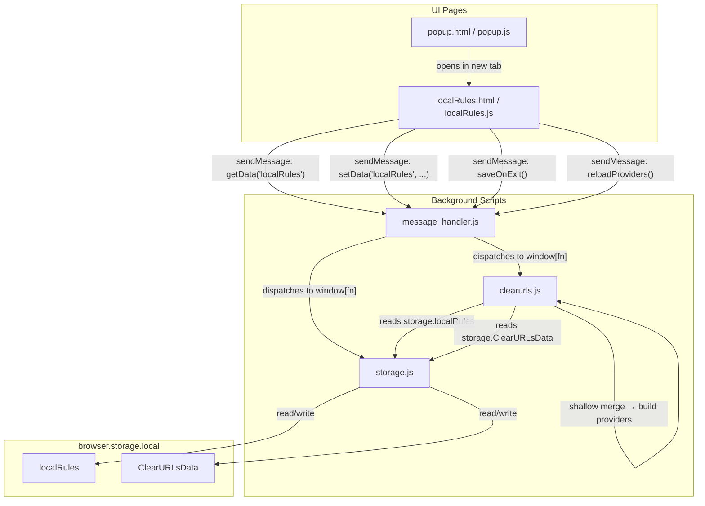

# Design Document: Local Rule Overrides

## Overview

This feature adds a local rule override system to the ClearURLs browser addon. Users can create, edit, and delete provider definitions that are stored in `browser.storage.local` and take priority over the remote ruleset fetched from `rules2.clearurls.xyz`. A new CRUD editor page provides a staging-based editing workflow where changes are visually indicated (green for new, yellow for edited, red for deleted) and only committed on an explicit Save action.

The implementation touches four areas of the codebase:

1. **Storage layer** (`core_js/storage.js`) — Adds `localRules` as a first-class storage key with JSON parse/stringify handling and a default empty-object initialization.
2. **Provider build pipeline** (`clearurls.js`) — Introduces a shallow merge step before `createProviders()` and a globally-accessible `reloadProviders()` function callable via the message handler.
3. **CRUD editor UI** (`html/localRules.html`, `core_js/localRules.js`) — A new page following the existing Bootstrap layout convention, with staging semantics and per-entry forms.
4. **Popup navigation** (`html/popup.html`, `core_js/popup.js`) — A new icon link in the `references_section` div.

## Architecture



### Data Flow: Save Cycle

1. User edits entries in the CRUD editor (all changes are staged in-page JS state).
2. User clicks Save → `localRules.js` sends `setData('localRules', JSON.stringify(stagedRules))`.
3. `message_handler.js` dispatches to `setData()` in `storage.js`, which JSON-parses the value into `storage.localRules`.
4. `localRules.js` sends `saveOnExit()` → `storage.js` writes all in-memory storage to disk.
5. `localRules.js` sends `reloadProviders()` → `clearurls.js` clears `providers[]` and `prvKeys[]`, performs the shallow merge of `storage.ClearURLsData.providers` with `storage.localRules`, and rebuilds all `Provider` objects.
6. The webRequest listener immediately uses the new `providers[]` array for subsequent requests.

## Components and Interfaces

### 1. Storage Layer Changes (`core_js/storage.js`)

**`initSettings()`** — Add `storage.localRules = {};` as the default. This must be set *before* the loop that overwrites defaults with persisted values, so existing data is preserved on subsequent starts.

**`setData(key, value)`** — Add a `case "localRules":` alongside the existing `"ClearURLsData"` case so the value is JSON-parsed before assignment:

```javascript
case "ClearURLsData":
case "localRules":
case "log":
    storage[key] = JSON.parse(value);
    break;
```

**`storageDataAsString(key)`** — Add `"localRules"` to the JSON-stringify cases:

```javascript
case "ClearURLsData":
case "localRules":
case "log":
    return JSON.stringify(value);
```

### 2. Provider Build Pipeline (`clearurls.js`)

**CRITICAL DESIGN CONSTRAINT**: `storage.ClearURLsData` must NEVER be mutated with merged data. It holds the pristine remote ruleset and is persisted to disk by `saveOnExit()` and `saveOnDisk()`. Writing merged providers into it would contaminate the remote ruleset on disk, causing local rules to be baked in permanently and re-merged on subsequent starts. The merged providers object must only ever exist as a local variable, never touching `storage`.

**`mergeProviders(remoteProviders, localRules)`** — A new pure function (defined at module scope, outside `start()`) that performs the shallow merge and returns a **new object**, leaving both inputs untouched:

```javascript
function mergeProviders(remoteProviders, localRules) {
    if (!localRules || typeof localRules !== 'object') {
        return Object.assign({}, remoteProviders);
    }
    // Start with a copy of remote, then overwrite with local
    return Object.assign({}, remoteProviders, localRules);
}
```

This returns a new object. Keys present in `localRules` completely replace the remote entry (shallow replace). Keys only in `localRules` are added. Keys only in `remoteProviders` pass through unchanged.

**Modification to `createProviders()`** — The existing `createProviders()` reads from `let data = storage.ClearURLsData` and then accesses `data.providers[prvKeys[p]]`. To avoid mutating `storage.ClearURLsData.providers`, we modify `createProviders()` to accept a `mergedProviders` parameter that it reads from instead:

```javascript
// Inside start():
function createProviders(mergedProviders) {
    // Use the passed-in merged object instead of storage.ClearURLsData
    let data = { providers: mergedProviders };

    for (let p = 0; p < prvKeys.length; p++) {
        providers.push(new Provider(prvKeys[p],
            data.providers[prvKeys[p]].getOrDefault('completeProvider', false),
            data.providers[prvKeys[p]].getOrDefault('forceRedirection', false)));
        // ... rest of provider construction unchanged
    }
}
```

**Modification to `toObject()`** — Produces the merged object as a local variable and passes it through:

```javascript
function toObject(retrievedText) {
    let merged = mergeProviders(
        storage.ClearURLsData.providers,
        storage.localRules
    );
    getKeys(merged);
    createProviders(merged);
}
```

`storage.ClearURLsData.providers` is read but never written. The `merged` variable is local to `toObject()` and exists only for the duration of the provider build.

**`reloadProviders()`** — Defined inside `start()` (so it has access to `createProviders` and `Provider`) and attached to `window` so the message handler can dispatch it. It also only uses a local merged variable:

```javascript
// Inside start(), after createProviders and Provider are defined:
window.reloadProviders = function() {
    providers = [];
    prvKeys = [];

    let merged = mergeProviders(
        storage.ClearURLsData.providers,
        storage.localRules
    );

    getKeys(merged);
    createProviders(merged);

    return "OK";
};
```

**Why this is safe**: `storage.ClearURLsData` is never assigned to, never mutated. The merged object is a fresh `Object.assign` copy that lives only as a local variable inside `toObject()` or `reloadProviders()`. When `saveOnExit()` or `saveOnDisk(['ClearURLsData', ...])` serializes `storage.ClearURLsData`, it persists only the original remote data.

**Implementation note on scope**: `reloadProviders` is defined inside `start()` and attached to `window`, which keeps `Provider` and `createProviders` in their current nested scope. The tradeoff is that `reloadProviders` only becomes available after `start()` has run, which is guaranteed since `genesis()` calls `start()` before any UI messages can arrive. The `mergeProviders()` function remains at module scope since it has no dependency on inner functions.

**Design note on `prvKeys` and `getKeys()` side effect**: While `createProviders()` now receives the merged providers as a clean parameter, `getKeys()` still populates the module-scope global `prvKeys` array as a side effect. Ideally, key extraction would also be passed as a parameter (or handled internally by `createProviders`), eliminating the reliance on a global. However, this is the existing pattern used by the original `toObject()` code. Since `prvKeys` is not read outside the `getKeys`/`createProviders` sequence, and both `reloadProviders()` and `toObject()` reset `prvKeys` to `[]` before calling `getKeys()`, the side effect is contained and predictable. We leave this as-is to minimize refactoring of existing code patterns. A future cleanup could have `createProviders` extract keys from its own `mergedProviders` parameter internally.

### 3. CRUD Editor Page

#### `html/localRules.html`

Follows the exact HTML structure of `cleaningTool.html` and `settings.html`:
- Same Bootstrap CSS, `core.css`, `switchButtons.css` includes
- Same navbar with ClearURLs logo and version badge
- Content area: a provider list/table, an add button, page-level Save/Cancel buttons
- Script references: `browser-polyfill.js`, `core_js/localRules.js`, `core_js/write_version.js`

#### `core_js/localRules.js`

**State model**:

```javascript
// The last persisted state (loaded from storage)
var persistedRules = {};

// The staged state (working copy, includes uncommitted changes)
var stagedRules = {};

// Track change status per provider name for color indicators
// Values: "new" | "edited" | "deleted" | null
var changeStatus = {};
```

**Key functions**:

| Function | Description |
|---|---|
| `init()` | Loads `localRules` from storage via `getData`, deep-clones into `persistedRules` and `stagedRules`, renders the list. |
| `renderList()` | Clears and rebuilds the provider table/list from `stagedRules` + `changeStatus`. Applies CSS classes: `.local-rule-new` (green), `.local-rule-edited` (yellow), `.local-rule-deleted` (red + strikethrough). |
| `parseCommaSeparated(value)` | Parses a JSON-quoted, comma-separated string into an array of strings via `JSON.parse`. Trims input, strips trailing comma. Returns `null` on parse failure. See "CRITICAL DESIGN CONSTRAINT — Array field parsing" above. |
| `joinForDisplay(arr)` | Converts an array to a JSON-quoted, comma-separated display string via `JSON.stringify` per element. Round-trips with `parseCommaSeparated`. |
| `openAddForm()` | Shows the provider form with empty fields. On OK: validates, adds to `stagedRules`, sets `changeStatus[name] = "new"`, re-renders. On Cancel: closes form, no state change. |
| `openEditForm(name)` | Populates form with `stagedRules[name]`. Stores a snapshot before editing. On OK: validates, updates `stagedRules[name]`, sets `changeStatus[name] = "edited"` (or keeps `"new"` if it was new), re-renders. On Cancel: restores snapshot, closes form. |
| `markForDeletion(name)` | Sets `changeStatus[name] = "deleted"`, re-renders (does not remove from `stagedRules` until Save). |
| `save()` | Removes entries marked `"deleted"` from `stagedRules`. Sends `setData('localRules', JSON.stringify(stagedRules))`, then `saveOnExit()`, then `reloadProviders()`. On success: copies `stagedRules` to `persistedRules`, clears `changeStatus`, re-renders. |
| `cancel()` | Deep-clones `persistedRules` into `stagedRules`, clears `changeStatus`, re-renders. |
| `validateForm(data)` | Returns `{ valid: boolean, errors: { name, urlPattern, arrayFields } }`. Checks: Provider_Name non-empty, `urlPattern` non-empty and valid RegExp, all array fields parsed successfully (not `null`). |

**Form field mapping** (provider form):

| Field | HTML Input Type | Required | Notes |
|---|---|---|---|
| Provider_Name | text input | Yes | Must be non-empty. Becomes the object key. |
| urlPattern | text input | Yes | Must be non-empty, valid RegExp. |
| rules | text input | No | JSON-quoted, comma-separated. Parsed via `JSON.parse`. Empty = `[]`. |
| rawRules | text input | No | JSON-quoted, comma-separated. Parsed via `JSON.parse`. Empty = `[]`. |
| exceptions | text input | No | JSON-quoted, comma-separated. Parsed via `JSON.parse`. Empty = `[]`. |
| redirections | text input | No | JSON-quoted, comma-separated. Parsed via `JSON.parse`. Empty = `[]`. |
| referralMarketing | text input | No | JSON-quoted, comma-separated. Parsed via `JSON.parse`. Empty = `[]`. |
| completeProvider | checkbox | No | Boolean, defaults `false`. |
| forceRedirection | checkbox | No | Boolean, defaults `false`. |

**CRITICAL DESIGN CONSTRAINT — Array field parsing**: Array fields (rules, rawRules, exceptions, redirections, referralMarketing) contain regex patterns that frequently include commas inside quantifiers (e.g. `{2,}`, `{1,3}`). Naive comma-splitting would corrupt these patterns. Instead, values are entered in JSON-quoted format: `"value1", "value2with,comma"`. Parsing uses `JSON.parse("[" + input + "]")` which correctly preserves commas inside quoted strings.

**`parseCommaSeparated(value)`** — Parses the JSON-quoted input:
1. Trim the input
2. Strip a trailing comma if present (then trim again)
3. If empty after trimming, return `[]`
4. Wrap in `[` and `]` to form a JSON array string
5. `JSON.parse()` — on failure, return `null` (caller shows validation error)
6. Verify the result is an array where every element is a string; return `null` otherwise
7. Return the parsed array

**`joinForDisplay(arr)`** — Converts an array back to the quoted input format by calling `JSON.stringify()` on each element and joining with `, `. This produces output like `"utm_source", "^https?:\\/\\/example\\.com(?:\\.[a-z]{2,}){1,}"` that round-trips correctly through `parseCommaSeparated`.

Each array field has a corresponding `<div class="error-message">` element in the HTML (e.g. `error_rules`, `error_exceptions`) for displaying parse errors inline.

**Staging semantics detail**:

The form-level OK/Cancel is separate from the page-level Save/Cancel:

- **Form OK**: Stages the change into `stagedRules` and `changeStatus`. The form closes.
- **Form Cancel**: Reverts the form's working data to the state before the form was opened. The form closes.
- **Page Save**: Commits all staged changes to storage and triggers provider reload.
- **Page Cancel**: Discards all staged changes by reverting to `persistedRules`.

**Button state rules**:

Page-level Save button is enabled if and only if:
- The effective staged rules (staged minus entries marked "deleted") differ from `persistedRules` (deep comparison via `JSON.stringify`).
- Edge cases that keep Save disabled: add provider X then delete X before saving; edit a provider then manually revert all fields to original values; mark a provider deleted then un-delete it (restoring original state).

Form-level OK button is enabled if and only if:
- **Add mode**: at least one text field is non-empty OR any checkbox is non-default (checked).
- **Edit mode**: any form field value differs from the snapshot captured when the form was opened (raw string comparison for text fields, boolean comparison for checkboxes).
- Button state updates in real-time on every `input`/`change` event.

Re-opening a staged entry preserves its staged values. For example:
1. User creates entry "foo" → OK → status is "new", staged.
2. User edits "foo" → changes urlPattern → OK → status remains "new", new urlPattern applied.
3. User edits "foo" → changes urlPattern again → Cancel → urlPattern reverts to step 2's value.

**Delete-then-re-add**: Adding a provider whose name matches an entry marked "deleted" replaces the deletion. The entry gets the new data and status becomes "edited" (not "new"), since the name already existed in persisted state.

### 4. Popup Changes

**`html/popup.html`** — Add a new anchor element in the `references_section` div, between the existing cleaning tools and settings icons:

```html
<a id="local_rules" target="_blank">
    <span class="fas fa-edit" style="font-size: 1.5em; margin-right: 1em;"></span>
</a>
```

**`core_js/popup.js`** — In the init chain, set the href and tooltip:

```javascript
document.getElementById('local_rules').href = browser.runtime.getURL('./html/localRules.html');
```

In `setText()`, add:

```javascript
document.getElementById('local_rules').title = translate('popup_local_rules_title');
```

### 5. Message Handler

No changes to `core_js/message_handler.js`. The existing `handleMessage` function already dispatches any function name present on `window`. Since `reloadProviders` will be assigned to `window` inside `start()`, and `setData`/`getData`/`saveOnExit` are already global, no new message handling code is needed.

## Data Models

### `localRules` Storage Object

```json
{
  "myCustomProvider": {
    "urlPattern": "example\\.com",
    "rules": ["utm_source", "utm_medium"],
    "rawRules": [],
    "exceptions": ["example\\.com\\/login"],
    "redirections": [],
    "referralMarketing": [],
    "completeProvider": false,
    "forceRedirection": false
  },
  "anotherProvider": {
    "urlPattern": "tracker\\.net",
    "rules": ["ref", "click_id"],
    "rawRules": [],
    "exceptions": [],
    "redirections": [],
    "referralMarketing": [],
    "completeProvider": false,
    "forceRedirection": false
  }
}
```

Shape: `Record<string, ProviderDefinition>` — identical to the `providers` sub-object within `ClearURLsData`.

### `ProviderDefinition` Fields

| Field | Type | Default | Description |
|---|---|---|---|
| urlPattern | string | (required) | Regular expression matching URLs this provider handles |
| rules | string[] | [] | Query parameter patterns to remove |
| rawRules | string[] | [] | Raw regex rules applied directly to the URL string |
| exceptions | string[] | [] | URL patterns exempt from this provider's rules |
| redirections | string[] | [] | Regex patterns to extract redirect targets |
| referralMarketing | string[] | [] | Referral marketing parameter patterns |
| completeProvider | boolean | false | If true, blocks the entire URL |
| forceRedirection | boolean | false | If true, uses `tabs.update` for redirects |

### Staging State Model (in-page, not persisted)

```
persistedRules: Record<string, ProviderDefinition>  // last saved snapshot
stagedRules:    Record<string, ProviderDefinition>  // working copy
changeStatus:   Record<string, "new" | "edited" | "deleted" | null>
```


## Correctness Properties

*A property is a characteristic or behavior that should hold true across all valid executions of a system — essentially, a formal statement about what the system should do. Properties serve as the bridge between human-readable specifications and machine-verifiable correctness guarantees.*

### Property 1: Shallow Merge Correctness

*For any* remote providers map R and local rules map L, the result of `mergeProviders(R, L)` SHALL contain exactly the union of keys from R and L, where: (a) for every key present in both R and L, the merged value equals L's value; (b) for every key present only in L, the merged value equals L's value; (c) for every key present only in R, the merged value equals R's value.

**Validates: Requirements 2.2, 2.3, 2.4**

### Property 2: localRules JSON Serialization Round-Trip

*For any* valid `localRules` object (a `Record<string, ProviderDefinition>`), calling `setData("localRules", JSON.stringify(obj))` followed by `getData("localRules")` SHALL return an object deeply equal to the original.

**Validates: Requirements 1.4**

### Property 3: initSettings Preserves Existing localRules

*For any* non-empty `localRules` object already present in `storage`, calling `initSettings()` SHALL NOT modify `storage.localRules` — the value after `initSettings()` SHALL be deeply equal to the value before.

**Validates: Requirements 1.3**

### Property 4: Reload Providers Matches Fresh Build

*For any* combination of `storage.ClearURLsData` (with a `providers` sub-object) and `storage.localRules`, calling `reloadProviders()` SHALL produce the same set of provider names in `prvKeys` as performing a fresh merge of `ClearURLsData.providers` with `localRules` — specifically, `prvKeys` after reload SHALL equal the set of keys in `mergeProviders(ClearURLsData.providers, localRules)`.

**Validates: Requirements 3.1, 3.3**

### Property 5: Staging State Machine Transitions

*For any* initial `persistedRules` and any sequence of staging operations (add with OK, edit with OK, edit with Cancel, mark-delete), the `changeStatus` for each provider SHALL follow these rules: (a) a newly added entry has status `"new"` regardless of how many times it is subsequently edited with OK; (b) an entry from `persistedRules` that is edited has status `"edited"`; (c) form Cancel for any entry reverts its data in `stagedRules` to the snapshot taken when the form was opened, without changing `changeStatus`.

**Validates: Requirements 4.3, 4.4, 4.6, 4.7**

### Property 6: Page Cancel Restores Persisted State

*For any* set of staged changes (adds, edits, deletions), clicking the page-level Cancel SHALL reset `stagedRules` to a deep copy of `persistedRules` and clear all entries in `changeStatus` — the resulting state SHALL be deeply equal to the state immediately after the last successful Save (or initial load).

**Validates: Requirements 5.3**

### Property 7: Save Round-Trip

*For any* set of staged rules (after removes of "deleted" entries), executing the Save action SHALL result in `persistedRules` being deeply equal to the saved `stagedRules`, and a subsequent `getData("localRules")` from storage SHALL return an object deeply equal to `persistedRules`.

**Validates: Requirements 5.1**

### Property 8: Provider Form Validation

*For any* string `name` and string `pattern`, and *for any* set of array field input strings, the `validateForm` function SHALL return valid=true if and only if: (a) `name` is a non-empty string (after trimming), AND (b) `pattern` is a non-empty string AND `new RegExp(pattern)` does not throw, AND (c) all array fields parsed successfully (none returned `null` from `parseCommaSeparated`). For all other inputs, it SHALL return valid=false with appropriate error messages.

**Validates: Requirements 8.1, 8.2**

### Property 9: Render List Completeness

*For any* `stagedRules` object containing N entries, the rendered provider list SHALL contain exactly N entries, and each rendered entry SHALL display the provider name and urlPattern corresponding to its `stagedRules` entry.

**Validates: Requirements 4.2**

### Property 10: Locale Key Completeness

*For any* locale directory in `_locales/`, the `messages.json` file SHALL contain all message keys required by the CRUD editor. The set of required keys SHALL be identical across all 22 locale directories.

**Validates: Requirements 7.2**

### Property 11: Array Field Round-Trip Integrity

*For any* array of strings (including strings containing commas, backslashes, quotes, and regex quantifiers like `{2,}` or `{1,3}`), calling `joinForDisplay(arr)` followed by `parseCommaSeparated(result)` SHALL return an array deeply equal to the original. This ensures that regex patterns with embedded commas survive the display → edit → parse cycle without corruption.

**Validates: Requirements 4.3, 8.3**

## Error Handling

### Storage Errors

- If `setData` or `saveOnExit` messaging fails during Save, the CRUD editor logs the error via `console.error` and leaves the UI in its current staged state so the user can retry. The `persistedRules` snapshot is not updated on failure, ensuring Cancel always has a valid fallback.

### Validation Errors

- Invalid Provider_Name (empty/whitespace) or invalid urlPattern (empty or invalid regex) triggers inline error messages next to the offending field. The form remains open. No data is staged.
- `new RegExp(pattern)` is wrapped in a try/catch to detect invalid regex syntax.
- Array fields (rules, rawRules, exceptions, redirections, referralMarketing) that fail `JSON.parse` or are not of type array with elements string display an inline error

### Merge Edge Cases

- If `storage.localRules` is `null`, `undefined`, or not an object, `mergeProviders` treats it as empty and returns a copy of the remote providers only.
- If `storage.ClearURLsData` or its `.providers` sub-object is missing (e.g., before first rule fetch completes), `reloadProviders` returns early without error. Providers will be built once the rule fetch succeeds and calls `toObject()`.

### Message Handler

- No changes needed. If `reloadProviders` is called before `start()` has completed (edge case during startup), `window.reloadProviders` will be `undefined` and the message handler returns `undefined`, which the caller can handle gracefully.

## Testing Strategy

**NOTE: Tests are not implemented as part of this feature.** The codebase currently has no test framework, no `package.json`, and no test runner. The test specifications below are preserved for future implementation — when a test framework is set up, these specifications can be used as a guide. All implementation tasks should skip test writing and test execution.

### Unit Tests (Example-Based)

Unit tests cover specific scenarios, edge cases, and integration points:

| Test | Validates |
|---|---|
| `initSettings` sets `storage.localRules` to `{}` | Req 1.2 |
| `storageDataAsString("localRules")` returns JSON string | Req 1.1 |
| `mergeProviders` with empty localRules returns copy of remote | Req 2.4 edge case |
| `mergeProviders` with null/undefined localRules returns copy of remote | Error handling |
| `reloadProviders` message returns `"OK"` | Req 3.2 |
| Mark-for-deletion sets status `"deleted"`, entry remains in stagedRules | Req 4.5 |
| Save removes `"deleted"` entries before persisting | Req 5.1 |
| Save failure logs to `console.error` | Req 5.4 |
| Validation rejects empty Provider_Name | Req 8.1 |
| Validation rejects invalid regex urlPattern | Req 8.2 |
| Validation accepts entry with all optional fields empty | Req 8.4 |
| `parseCommaSeparated` preserves regex patterns with commas (e.g. `{2,}`) | Property 11 |
| `parseCommaSeparated` returns `null` for malformed input (unquoted commas) | Property 11 |
| `joinForDisplay` → `parseCommaSeparated` round-trips arrays with special characters | Property 11 |
| `parseCommaSeparated` trims input and strips trailing comma | Property 11 |
| Popup link href set via `browser.runtime.getURL` | Req 6.3 |
| Popup link has i18n tooltip | Req 6.4 |
| `localRules.html` includes required script references | Req 4.7b |

### Property-Based Tests

Property-based tests use [fast-check](https://github.com/dubzzz/fast-check) to verify universal properties across many generated inputs. Each test runs a minimum of 100 iterations.

| Property Test | Design Property | Tag |
|---|---|---|
| Merge correctness (union of keys, local wins on overlap) | Property 1 | Feature: local-rule-overrides, Property 1: Shallow merge correctness |
| JSON round-trip for localRules via setData/getData | Property 2 | Feature: local-rule-overrides, Property 2: localRules JSON serialization round-trip |
| initSettings preserves existing localRules | Property 3 | Feature: local-rule-overrides, Property 3: initSettings preserves existing localRules |
| reloadProviders produces correct provider keys | Property 4 | Feature: local-rule-overrides, Property 4: Reload providers matches fresh build |
| Staging state machine transitions | Property 5 | Feature: local-rule-overrides, Property 5: Staging state machine transitions |
| Page cancel restores persisted state | Property 6 | Feature: local-rule-overrides, Property 6: Page cancel restores persisted state |
| Save round-trip (staged → storage → retrieve) | Property 7 | Feature: local-rule-overrides, Property 7: Save round-trip |
| Form validation accepts iff name non-empty and pattern valid regex | Property 8 | Feature: local-rule-overrides, Property 8: Provider form validation |
| Render list shows all providers with name and urlPattern | Property 9 | Feature: local-rule-overrides, Property 9: Render list completeness |
| All locale files contain all required keys | Property 10 | Feature: local-rule-overrides, Property 10: Locale key completeness |
| Array field round-trip (joinForDisplay → parseCommaSeparated preserves all strings including those with commas) | Property 11 | Feature: local-rule-overrides, Property 11: Array field round-trip integrity |

### Test Generators (fast-check)

Key generators for property tests:

- **`arbProviderDef()`** — Generates a random `ProviderDefinition` with: a random regex-safe string for urlPattern, random arrays of strings for rules/rawRules/exceptions/redirections/referralMarketing, random booleans for completeProvider/forceRedirection.
- **`arbLocalRules()`** — Generates a `Record<string, ProviderDefinition>` with 0–10 entries using random alphanumeric keys and `arbProviderDef()` values.
- **`arbProviderMaps()`** — Generates a pair `{ remote, local }` where keys may intentionally overlap to test merge behavior.
- **`arbStagingOps()`** — Generates a sequence of staging operations (`{ type: "add"|"editOK"|"editCancel"|"delete", name: string, data?: ProviderDefinition }`).

### Integration / Smoke Tests

- Verify `localRules.html` renders without JS errors when loaded as an extension page.
- Verify the full Save → reloadProviders flow updates active URL cleaning behavior.
- Verify popup link opens the local rules page.
